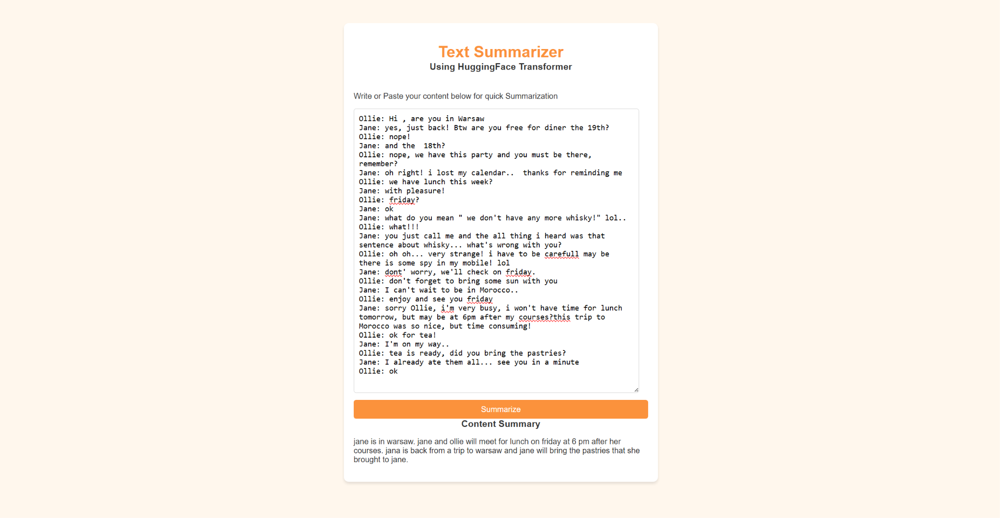
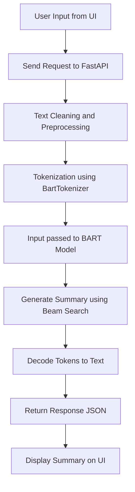

# 📝 Text Summarizer (BART-based)

<p align="center">
  
</p>

<p align="center">
  
  
  
  
  
</p>

<p align="center">
  🚀 FastAPI • 🤖 BART • ⚡ Real-time Summarization • 🎨 Clean UI
</p>

---

## 🚀 Overview

A **high-performance Text Summarization Web App** powered by  
🤖 **HuggingFace Transformers (BART)** and ⚡ **FastAPI**.

It converts long text or conversations into **concise, meaningful summaries** in real-time.

---

## ✨ Features

- ⚡ Real-time text summarization  
- 🤖 Fine-tuned **BART model**  
- 🧠 Abstractive summarization (understands context)  
- 🎨 Minimal & clean UI  
- 🔌 REST API support  
- 🚀 Fast backend with GPU support  

---

## 🧠 Model Details

| Component        | Value |
|------------------|------|
| Model           | `BartForConditionalGeneration` |
| Tokenizer       | `BartTokenizer` |
| Task            | Abstractive Summarization |
| Max Input Length| 512 tokens |
| Beam Search     | `num_beams = 4` |

---

## 🏗️ Project Structure

```bash
TextSummarizerAPP/
│
├── app.py                 # FastAPI backend
├── saved_summary_model/   # Trained BART model
│
├── templates/
│   └── index.html         # Frontend UI
│
├── static/
│   └── style.css          # Styling
│
└── README.md
```
---
## ⚙️ How It Works


---


## 📊 Performance

- ⚡ Average Response Time: ~1–3 seconds (CPU)
- 🚀 Faster with GPU (if available)
- 📉 Handles long dialogues efficiently using chunking


---

## 🔐 Limitations

- ⚠️ Max input length limited to 512 tokens  
- ⚠️ May lose fine details in very long texts  
- ⚠️ Performance depends on hardware (CPU vs GPU)  

---

## 🛠️ Tech Stack

| Layer        | Technology |
|-------------|-----------|
| Backend     | FastAPI |
| ML Model    | HuggingFace Transformers (BART) |
| Frontend    | HTML, CSS, JavaScript |
| Deployment  | Uvicorn |

---

## 🌐 Deployment (Optional)

You can deploy this project easily using:

- 🚀 Render  
- ☁️ AWS / EC2  
- 🤗 HuggingFace Spaces  

---

## 🧩 Future Scope

- 📄 Upload PDF / DOCX for summarization  
- 🌍 Multi-language support  
- 🎯 Custom summary length control  
- 📊 Add evaluation metrics (ROUGE, BLEU)  
- 💬 Chat-based summarization  

---

## 🤝 Contributing

Contributions are welcome!

1. Fork the repo  
2. Create a new branch  
3. Make changes  
4. Submit a PR  

---

## 📜 License

This project is open-source and available under the MIT License.

---

## 🙌 Acknowledgements

- HuggingFace 🤗  
- FastAPI ⚡  
- Open-source community ❤️  

---
